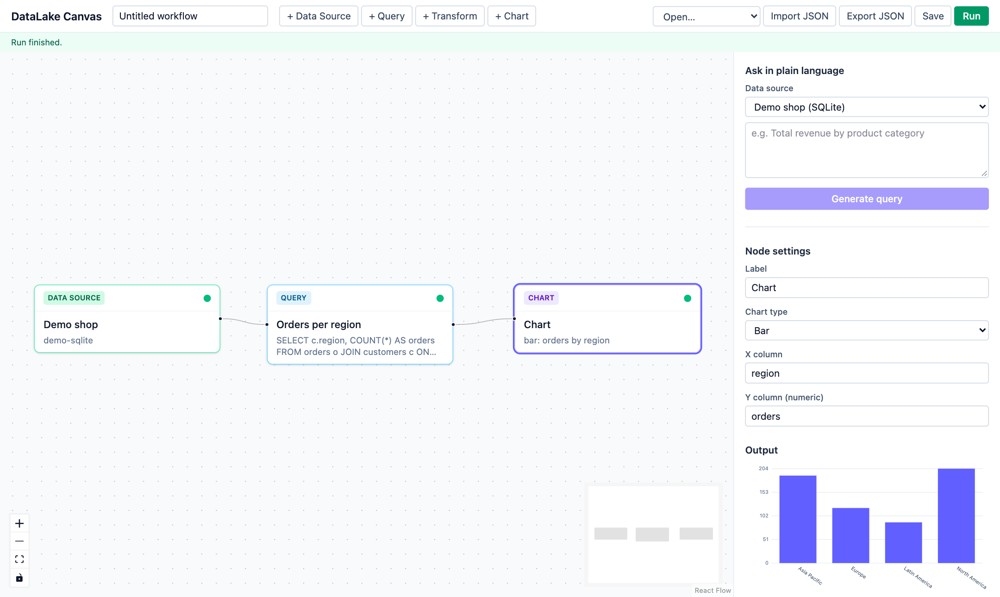
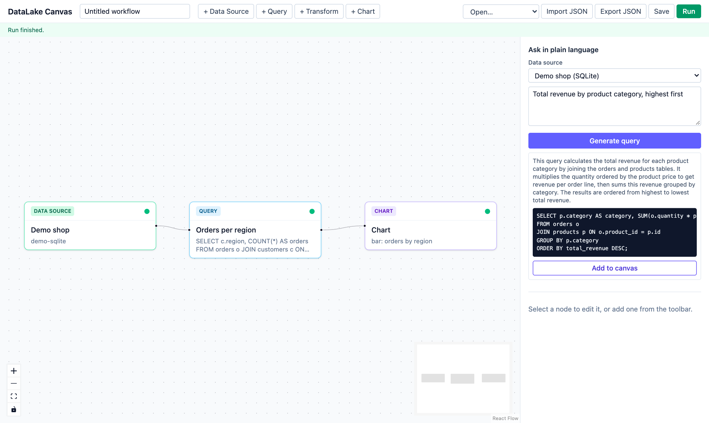
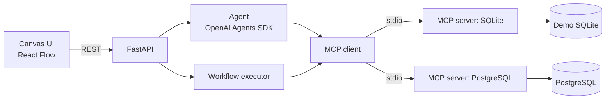

# DataLake Canvas

**A Figma-style whiteboard for your data queries: drag, connect and re-run analysis workflows instead of copy-pasting SQL.**

> **Status: early-stage (v0.1, pre-release).** The core loop works end to end on the bundled demo
> dataset, but expect rough edges and breaking changes. There is no authentication; see
> [SECURITY.md](SECURITY.md).

DataLake Canvas lets you place nodes (data source, query, transform, chart) on an infinite canvas,
connect them into a workflow, and re-run it whenever the data changes. You can also describe what you
want in plain language and have an LLM agent draft the query for you. Databases are reached through the
[Model Context Protocol](https://modelcontextprotocol.io) (MCP), so a new data source is just a new MCP
server.

It is aimed at analysts and research labs whose data is growing but who have no dedicated data engineer.

## Screenshots

A workflow on the bundled demo dataset: data source → query → chart, with per-node run status
and the selected node's output on the right.



Describe what you want in plain language; the agent drafts a read-only query (checked by the safety
guard) that you review and add to the canvas.



## Why

Two families of tools sit on either side of a gap:

* **Code-only notebooks** are flexible and reproducible, but the workflow lives in a linear script that
  only the author can comfortably read, share or re-run.
* **Closed BI tools** are friendly and visual, but are hosted, proprietary and hard to extend to the odd
  database, file format or lab-specific step.

DataLake Canvas aims at the middle: an open-source, self-hostable, visual workflow where each step is
inspectable, and where connectors are open MCP servers rather than vendor-specific plugins.

## Architecture



More detail in [docs/architecture.md](docs/architecture.md).

## Features

| Status | Feature |
| --- | --- |
| ✅ Implemented | Infinite canvas with DataSource, Query, Transform and Chart nodes (React Flow) |
| ✅ Implemented | Workflow CRUD API, topological executor with cycle detection and per-node error isolation |
| ✅ Implemented | Save/load workflows on the server, and import/export as JSON |
| ✅ Implemented | Read-only SQL guard (blocks DROP/DELETE/UPDATE/ALTER/TRUNCATE and more unless explicitly enabled) |
| ✅ Implemented | MCP client with a pluggable data source registry (JSON config) |
| ✅ Implemented | Reference MCP servers: SQLite (demo), PostgreSQL and MySQL |
| ✅ Implemented | Natural language → reviewable SQL plan via the OpenAI Agents SDK (needs your own API key; untested against the live API in CI) |
| ✅ Implemented | Provider interface (`LLMProvider`) so other LLM vendors can be added |
| 🚧 Planned | Additional LLM providers (e.g. Anthropic) |
| 🚧 Planned | Agent that calls MCP tools iteratively and repairs failing queries |
| 🚧 Planned | More transforms (group/aggregate, join, pivot) and richer charts |
| 🚧 Planned | Scheduled/automated re-runs, run history |
| 🚧 Planned | Authentication, multi-user workspaces, sharing |
| 🚧 Planned | More connectors (BigQuery, files/Parquet) |

## Quickstart (Docker, SQLite demo)

Requires Docker with Compose v2.

```bash
git clone https://github.com/KimDaeYu/datalake-canvas.git
cd datalake-canvas
cp .env.example .env        # optional: add OPENAI_API_KEY to enable the natural-language box
docker compose up --build
```

* UI: <http://localhost:8080> (a starter workflow is preloaded; click **Run**)
* API docs: <http://localhost:8000/docs>

The demo dataset is a small synthetic online shop (customers, products, orders) baked into the backend
image as a SQLite file. To try PostgreSQL as well, see [docs/data-sources.md](docs/data-sources.md).
An importable example lives in [`examples/workflows/`](examples/workflows).

### Without Docker

```bash
python -m venv .venv && source .venv/bin/activate   # Python 3.11+
make setup demo-db
make backend      # terminal 1: http://localhost:8000
make frontend     # terminal 2: http://localhost:5173
```

## Safety

Queries are read-only by default: a backend guard rejects write/DDL statements, the reference MCP
servers open read-only connections, and you should connect with a `SELECT`-only database role. The guard
is defense in depth, not a SQL parser. It reads statements with the lexing rules of each data source's
dialect (PostgreSQL, SQLite and MySQL are modelled; others get the strictest combined reading), and each
MCP server also enforces read-only access for its own engine. Details and limits are in
[SECURITY.md](SECURITY.md).

## Project layout

```
backend/       FastAPI app, executor, safety guard, MCP client, agent layer, tests
frontend/      React + TypeScript + Vite + Tailwind canvas UI
mcp-servers/   Reference MCP servers (postgres, sqlite, mysql)
examples/      Demo dataset and example workflows
config/        Data source registry files
docs/          Architecture, adding data sources, good first issues
```

## Roadmap

1. **Now:** stabilize the executor and node model; polish the canvas.
2. **Next:** more transforms and charts, schema browser, a second LLM provider, iterative agent.
3. **Later:** scheduling and run history, auth and multi-user workspaces, more connectors.

Roadmap items are intentions, not promises. Ideas and votes are welcome in issues.

## Contributing

Contributions are welcome. Start with [CONTRIBUTING.md](CONTRIBUTING.md) and
[docs/good-first-issues.md](docs/good-first-issues.md). Please follow the [Code of Conduct](CODE_OF_CONDUCT.md).

## License

[Apache License 2.0](LICENSE).
