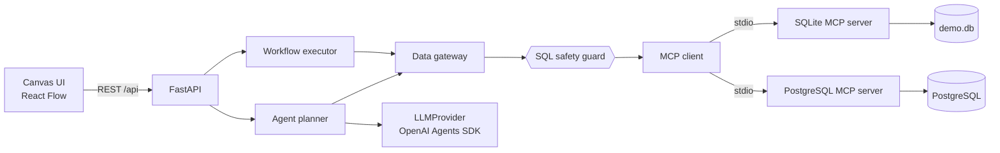

# Architecture

## Request flows

**Run a workflow.** `POST /workflows/{id}/run` loads the stored graph, computes a topological order
(Kahn's algorithm; cycles are rejected with HTTP 422) and runs each node with its upstream outputs.
Failures are isolated: a failed node marks everything downstream `skipped`, while independent branches
still run. Node outputs are typed (`table`, `datasource`, `chart`).

**Natural language.** `POST /agent/query` collects the schema through MCP (`list_tables`,
`describe_table`), asks the `LLMProvider` for a structured plan (SQL, explanation, optional chart), and
reports whether the safety guard would allow it. Nothing is executed; the UI lets the user review the
SQL and add it to the canvas as nodes.

## Safety layers

1. **Backend guard** (`safety.py`): single statement, `SELECT`/`WITH`/`VALUES` only, destructive/DDL
   keywords blocked, literals and comments ignored. Disabled only by `DLC_ALLOW_WRITE_QUERIES=true`.
   It reads the SQL with the lexing rules of the data source's `dialect` (PostgreSQL, SQLite, MySQL;
   any other dialect is checked against all of them and rejected if one reading objects), so the text
   is understood the way the engine will understand it.
2. **MCP server**: checks the statement prefix, opens the database read-only, and adds checks specific
   to its engine where needed. This layer is what covers each engine's own syntax.
3. **Database role**: use `SELECT`-only grants. The first two layers are heuristics, this one is a guarantee.

## Extension points

| To add... | Implement |
| --- | --- |
| A database | An MCP server with the three tools ([data-sources.md](data-sources.md)) |
| An LLM vendor | `LLMProvider.plan_query` in `backend/datalake_canvas/agent/`, then register it in `create_provider` |
| A node type | A config model + branch in `nodes.py` / `executor.py`, a component in `frontend/src/nodes/` |

## Known limitations

* The MCP client starts one server process per call (simple and robust, slower than pooling).
* Workflows are stored as JSON files; there is no multi-user state, auth or versioning.
* The agent makes a single LLM call; it does not iterate on errors or call MCP tools itself.
